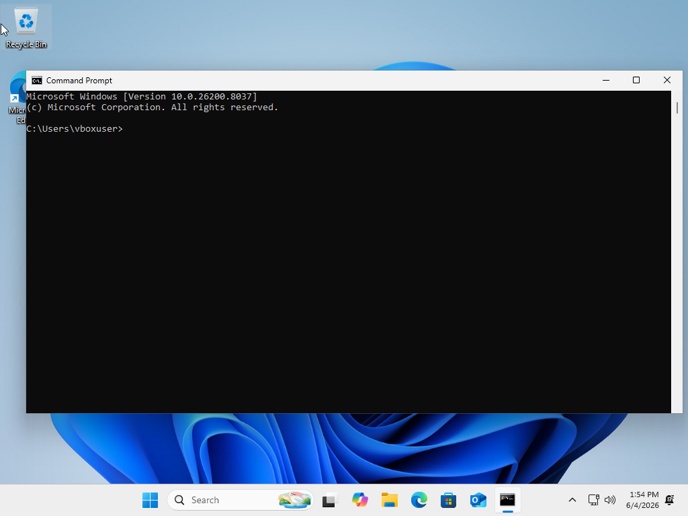
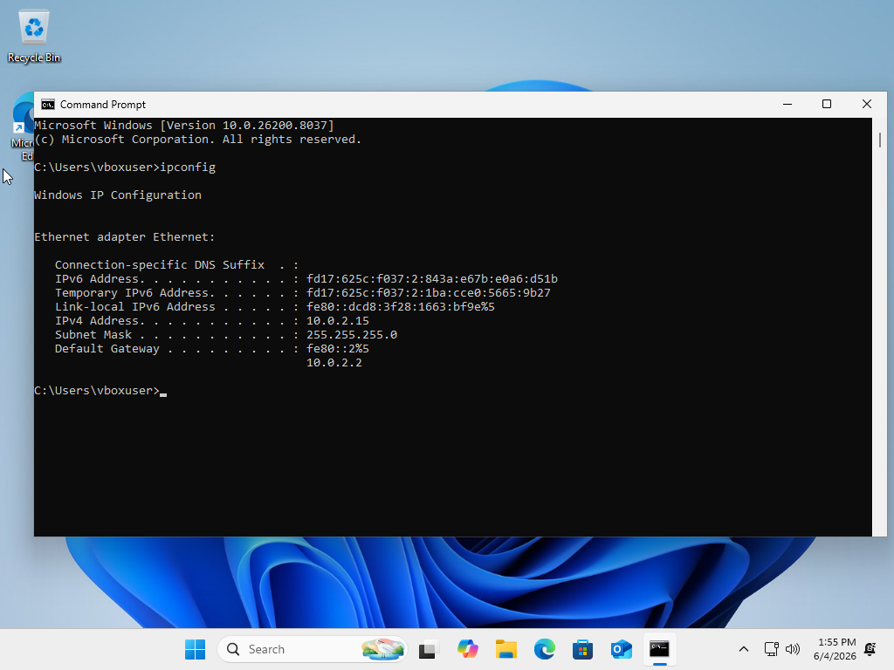
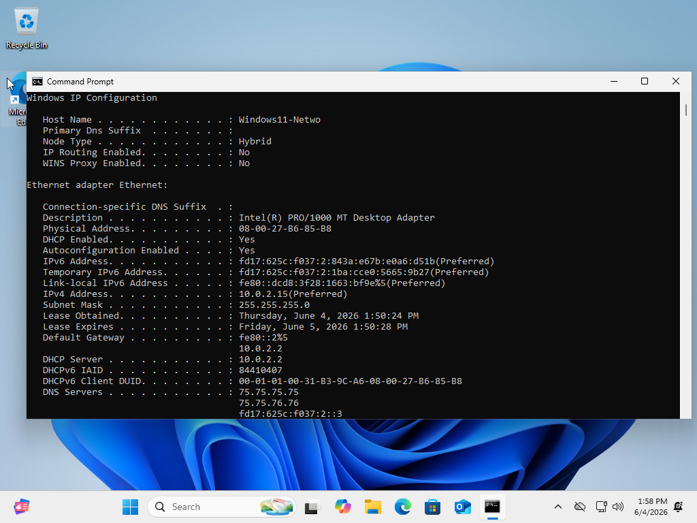
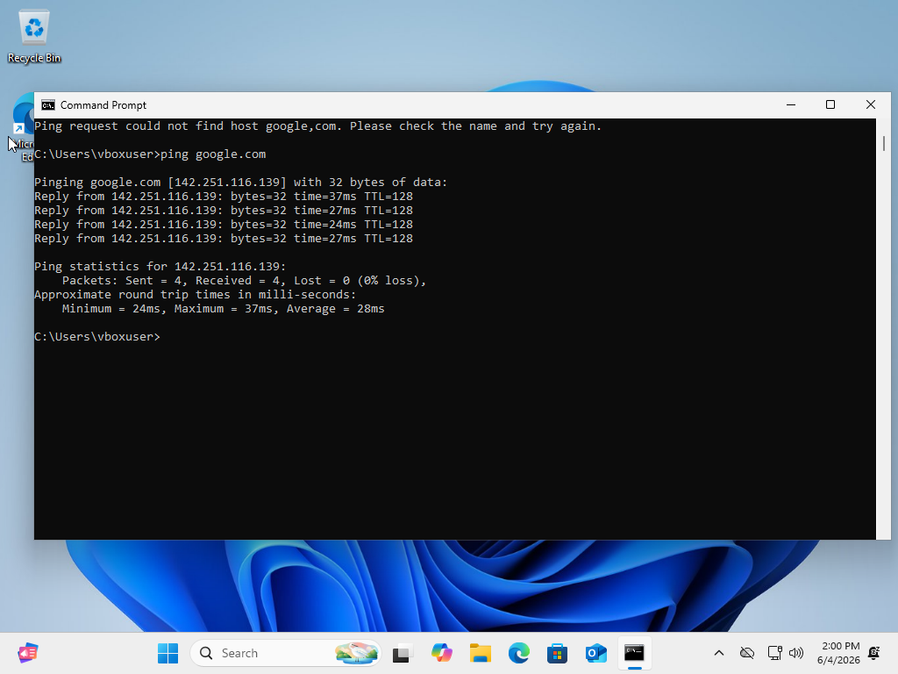
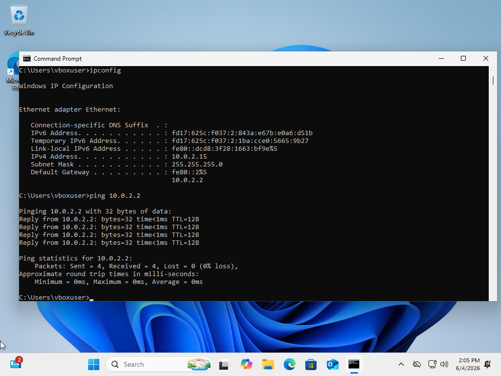
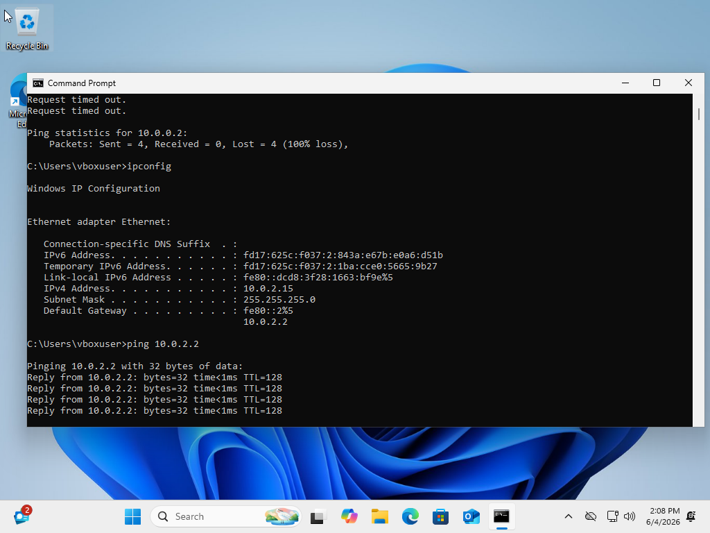
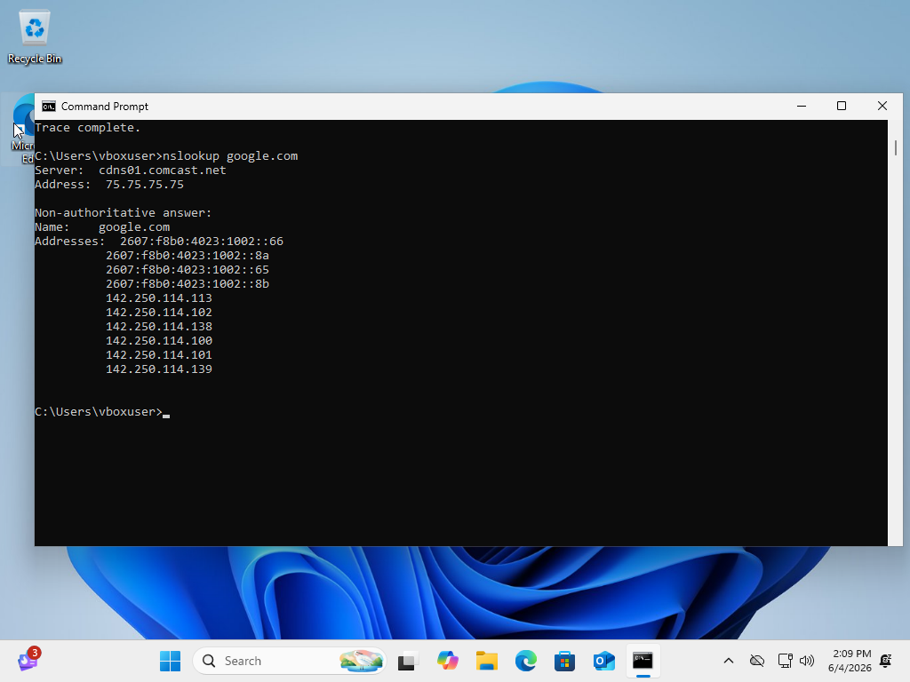
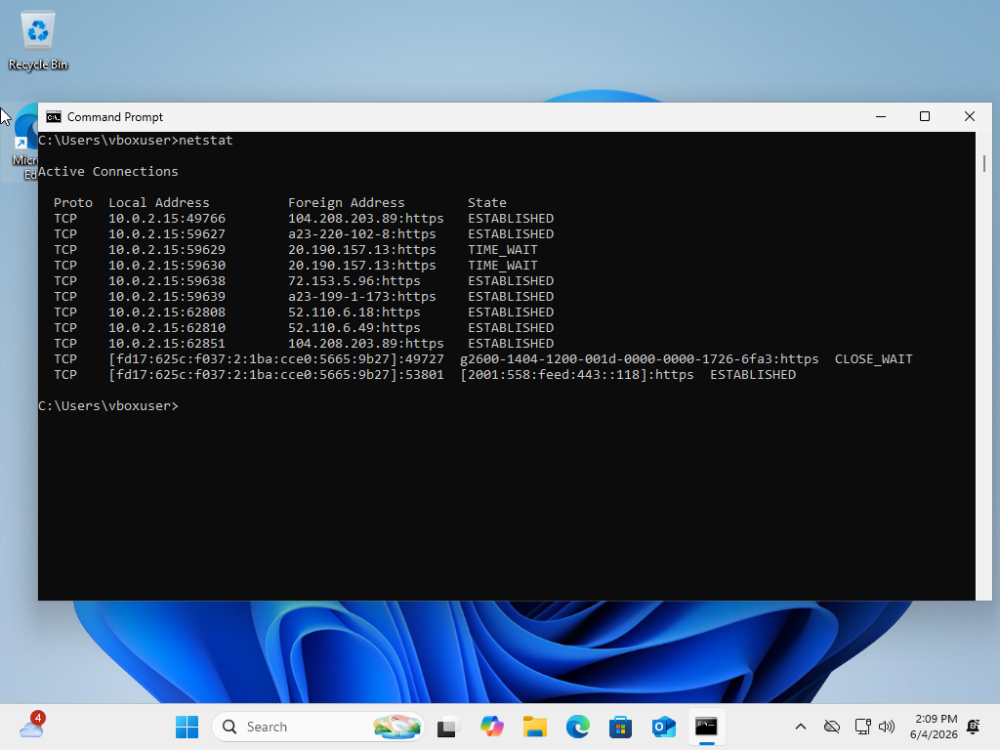
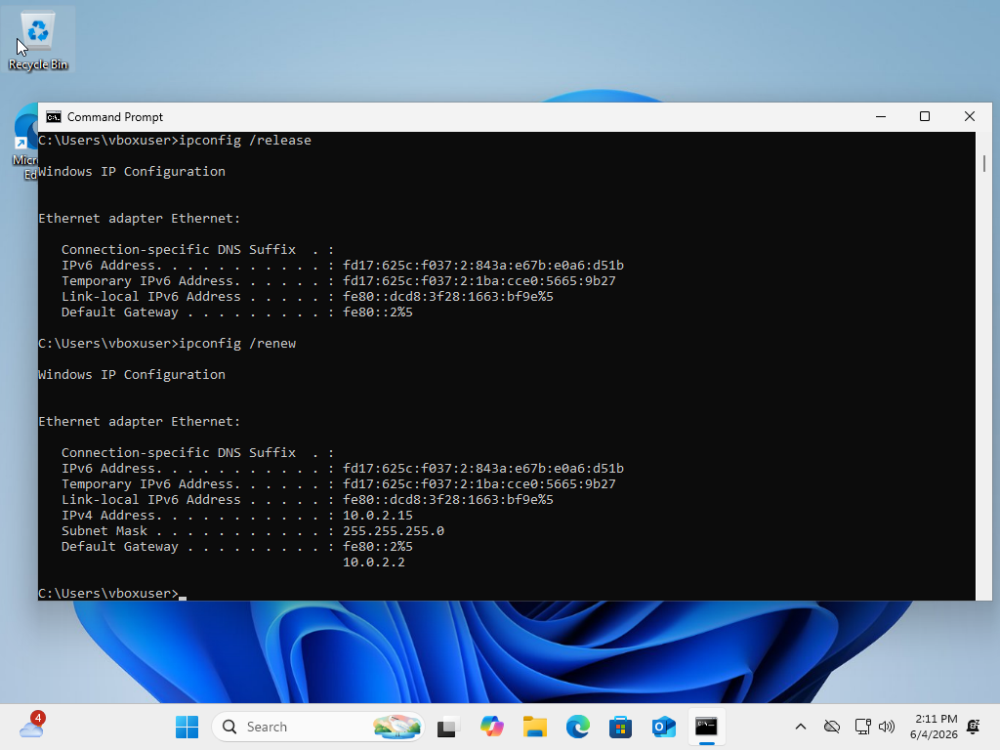

# Networking-Basics-Troubleshooting-Lab

## Objective

The objective of this lab was to practice basic Windows networking troubleshooting commands used in entry-level IT and help desk support. This lab demonstrates how to check IP configuration, test connectivity, verify DNS resolution, trace a network route, view active connections, and refresh network settings.

## Tools Used

* Windows 11 Virtual Machine
* Oracle VirtualBox
* Command Prompt
* ipconfig
* ping
* tracert
* nslookup
* netstat

## Lab Environment

This lab was completed inside a Windows 11 virtual machine running in Oracle VirtualBox. The virtual machine was configured with a NAT network adapter, allowing it to connect to the internet through the host computer.

## Steps Performed

### 1. Opened Command Prompt

I opened Command Prompt inside the Windows 11 virtual machine to begin running networking troubleshooting commands.



---

### 2. Checked Basic IP Configuration

I used the `ipconfig` command to view the virtual machine's network configuration, including the IPv4 address, subnet mask, and default gateway.

Command used:

```cmd
ipconfig
```

The system showed an IPv4 address of `10.0.2.15`, a subnet mask of `255.255.255.0`, and a default gateway of `10.0.2.2`.



---

### 3. Viewed Detailed Network Information

I used the `ipconfig /all` command to view more detailed network information, including the host name, network adapter description, physical address, DHCP status, DNS servers, and lease information.

Command used:

```cmd
ipconfig /all
```

This command confirmed that DHCP was enabled and that the virtual machine received its network configuration automatically.



---

### 4. Tested Internet Connectivity

I used the `ping` command to test internet connectivity by sending packets to Google.

Command used:

```cmd
ping google.com
```

The ping test was successful and returned replies with 0% packet loss, confirming that the virtual machine had internet connectivity.



---

### 5. Tested Default Gateway Connectivity

I identified the default gateway as `10.0.2.2` and tested connectivity to it using the `ping` command.

Command used:

```cmd
ping 10.0.2.2
```

The default gateway responded successfully with 0% packet loss.



---

### 6. Traced the Route to Google

I used the `tracert` command to trace the network path from the virtual machine to Google.

Command used:

```cmd
tracert google.com
```

This command displayed the route taken by packets as they traveled from the virtual machine to the destination.



---

### 7. Verified DNS Resolution

I used the `nslookup` command to confirm that DNS resolution was working.

Command used:

```cmd
nslookup google.com
```

The command successfully resolved `google.com` into multiple IPv4 and IPv6 addresses, confirming that DNS was functioning properly.



---

### 8. Viewed Active Network Connections

I used the `netstat` command to view active network connections on the virtual machine.

Command used:

```cmd
netstat
```

This displayed active TCP connections, local addresses, foreign addresses, and connection states.



---

### 9. Released and Renewed the IP Address

I used `ipconfig /release` and `ipconfig /renew` to release and renew the virtual machine's network configuration.

Commands used:

```cmd
ipconfig /release
ipconfig /renew
```

After renewing the IP address, the virtual machine received its IPv4 address and default gateway again.



---

## What I Learned

In this lab, I learned how to use common Windows networking commands to troubleshoot basic connectivity issues. I practiced checking IP configuration, verifying internet access, testing default gateway connectivity, confirming DNS resolution, tracing network routes, viewing active connections, and refreshing network settings.

These are important skills for entry-level help desk and IT support roles because they are commonly used when troubleshooting internet, DNS, DHCP, and local network connectivity problems.

## Skills Demonstrated

* Basic Windows network troubleshooting
* IP address verification
* DHCP troubleshooting
* DNS testing
* Gateway connectivity testing
* Command Prompt usage
* Network route tracing
* Active connection monitoring
* Technical documentation
